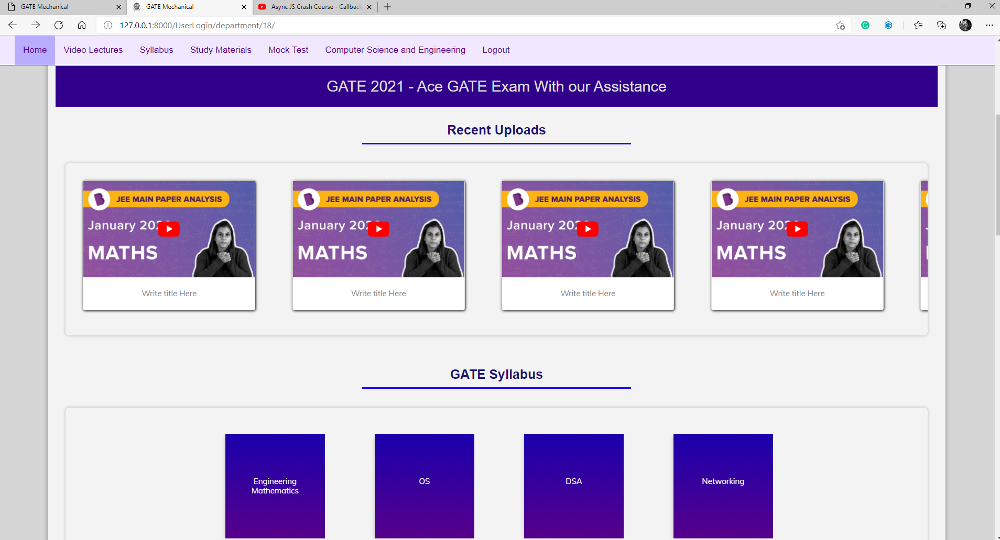
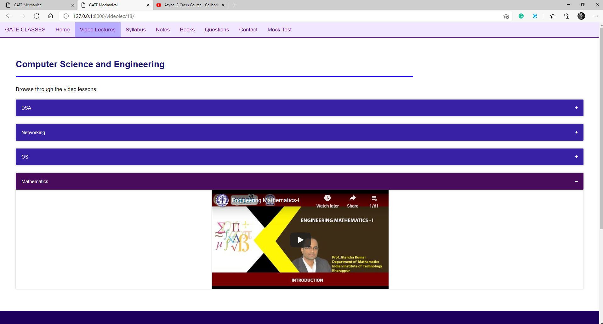
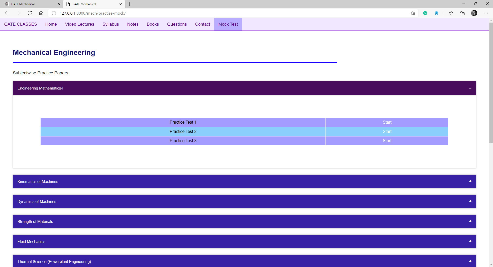

# GateEasy :tophat:
### An online platform for gate aspirants.
# Check out the Demo Deploment here: ( https://gate-easy-nit.herokuapp.com/ ) 
## Note:  Register as Computer Science Student and Do Check the Video and Mock Test Page : )

# FEATURES :fire:
- Syllabus
- Notes
- Past Question Papers
- E-Books
- Video Lectures
- Online Mock Tests

# FOLDER STRUCTURE :open_file_folder:

## [Pages](https://github.com/akash2099/GateEasy/tree/main/Pages)

- [**Home**](https://github.com/akash2099/GateEasy/tree/main/Pages/Home)
  - Login
  - Success Stories

- [**Department_SyllabusNotesBooksQuestionsContacts**](https://github.com/akash2099/GateEasy/tree/main/Pages/Department_SyllabusNotesBooksQuestionsContacts)
  - Syllabus
  - Notes
  - Books
  - Past Question Papers
  
     
 - [**VideoLecture**](https://github.com/akash2099/GateEasy/tree/main/Pages/VideoLecture)
   - Video Lecture Playlists according to syllabus
    

- [**ListOfMockTest**](https://github.com/akash2099/GateEasy/tree/main/Pages/ListOfMockTest)
   - All the available Mock Tests
   
   
- [**MockTest**](https://github.com/akash2099/GateEasy/tree/main/Pages/MockTest)
  - Main Mock Test
  
  
## [DjangoProject](https://github.com/akash2099/GateEasy/tree/main/DjangoProject)
  - Contains the Django Project Files and Folders
 
## [Resources](https://github.com/akash2099/GateEasy/tree/main/Resources)

- [**List of Mechanics Playlist**](https://github.com/akash2099/GateEasy/blob/main/Resources/Playlist_Mechanics.txt)

## [Archive](https://github.com/akash2099/GateEasy/tree/main/Archive)
  - Shall contain older version of GateEasy Project
  

*Thank you*
